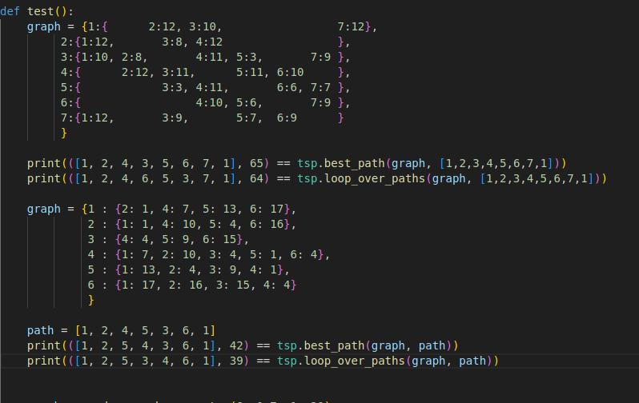
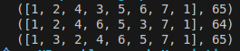

*ALEKSANYAN Volodya    
COURNIL-RABEUX Clément   
LDD3 IM*

---

## **K-coloriage**

Nous avons suivi l'algorithme heuristique vu en cours de k-coloriage 
et nous avons décidé de l'implémenter en python .

### Structure du graphe
La structure d'un graphe est représentée comme un dictionnaire avec en clefs les noeuds et en valeur la liste des noeuds liés
Un coloriage est ici représenté comme un dictionnaire associant à chaque noeud une couleur (un nombre entier ici)

### Algorithme 

Dans l'algorithme, on colorie le noeud de plus haut degré, puis on colorie de la même couleur le + de  noeuds possibles n'y étant pas connectés 
Puis on choisit un nouveau noeud de plus haut degré possible non coloré, et on recommence .
Il faut donc garder en mémoire les noeuds déjà coloriés, avoir accès au noeud de plus haut degré et pouvoir vérifier les couleur de ses voisins.
Il faut de + pouvoir vérifier que tout les noeuds ont bien été attribué d'une couleur (si le nombre de couleurs utilisés ne dépasse pas le seuil donné),
et pouvoir énumérer les noeuds n'étant pas nos voisins .
C'est pourquoi nous avons crée les fonctions respectives max_degre,neighbours_colors,is_colored et get_not_connected . 
L'algorithme est implémenté dans la fonction naive_coloration.

---

## **Problème du Voyageur du Commerce**

Dans un premier temps, nous avons implémenté l'algorithme naïf vu en cours, qui essaie toutes les permutations améliorant localement le résultat.

### **Structure du graphe**
Le graphe est représenté comme un dictionnaire qui, pour chaque nœud, associe un dictionnaire de nœuds avec leur poids. Les arcs sont supposés être symétriques.  
Un chemin commence par un nœud, passe par tous les autres nœuds exactement une fois et finit sur lui-même. Il est représenté par un tableau d'entiers.

### **Algorithme**
Nous avons implémenté un code pour générer un graphe aléatoire ainsi que pour trouver un cycle hamiltonien.  
Pour l'algorithme du cours, après avoir déroulé à la main, on trouve le même résultat.  

Nous avons également implémenté l'algorithme connu **2-OPT**, encore une fois en se basant sur le cours, et nous avons remarqué que pour des graphes pas très grands, la différence est minime. De plus, souvent, le résultat est pire, comme le montre l'image ci-dessous :  

Néanmoins, après avoir généré un graphe plus grand, de taille 15, on remarque qu'à chaque fois, en utilisant l'heuristique, on arrive à un meilleur résultat. Ce résultat est bien plus prometteur.  

---

## **Améliorations ?**
Nous n'avons malheureusement pas eu le temps de tester d'autres algorithmes en raison des contraintes de temps, même si nous avions pensé à explorer les heuristiques présentées en cours et à utiliser la programmation dynamique. Nous avons perdu du temps à coder un algorithme pour vérifier si le graphe est **k-coloriable**, car l'énoncé l'a suggéré alors qu'en réalité, ce n'était pas nécessaire.
